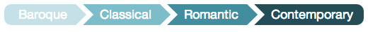
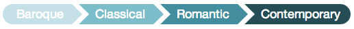
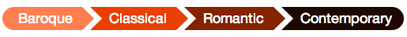
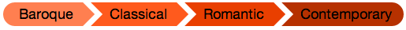
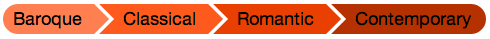
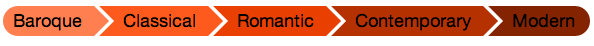

#timeline-css

> A [SASS](http://sass-lang.com/) mixin to generate timeline / breadcrumbs CSS. 


#pre-requisites

Install RubyGems [SASS](http://sass-lang.com/) and [Compass](http://compass-style.org/)

```
gem install sass
gem install compass
```

Install [NodeJS and NPM](http://nodejs.org/)

#getting started

###install

- with bower: `bower install timeline-css`
- git clone: `git clone git@github.com:sayanee/timeline-css.git`

###html

Integrate the HTML code into your view files. The number of list items within the `<li>` tags is 4 by default. If you want to have more/less number of list-items, generate it with SCSS/SASS files.

	<ul class="timeline">
	  <li>apple</li>
	  <li>banana</li>
	  <li>pear</li>
	  <li>orange</li>
	</ul>

You can use either of the **3 syntaxes**: CSS, SCSS or SASS

###generate css & scss by varying properties

1. install relevant packages

	```
	npm install
	```
1. change the mixin arguments and the class name in file `sass/timeline`
1. run `grunt` to compile SASS to SCSS and CSS

###1. with css

1. include the file `css/timeline.css` in your HTML file
	

###2. with SCSS

1. include the files `scss/timeline-mixin.scss` as a mixin
1. with reference to file `scss/timeline.scss` import compass and the timeline mixin
	
	```
	@import "compass/css3";
	@import "timeline-mixin";
	```
1. call the mixin with a class name e.g. `.breadcrumb`
	
	```
	.breadcrumb {
	  @include timeline(50px, 10px, #c5e1e7, 20%, white, 10px, 4);
	}
	```
1. compile SCSS to CSS 

###3. with sass

1. include the files `scss/timeline-mixin.sass` as a mixin
1. with reference to file `scss/timeline.sass` import compass and the timeline mixin
	
	```
	@import "compass/css3"
	@import "timeline-mixin"
	```
1. call the mixin with a class name e.g. `.breadcrumb`
	
	```
	.breadcrumb 
	  @include timeline(50px, 10px, #c5e1e7, 20%, white, 10px, 4)
	```
1. compile SASS to CSS


#options

The SASS mixin is defined with the following arguments:

```
@mixin timeline($height, $curved-corner, $background-color, $darkenby-percent, $textcolor, $seperation, $depth)
```

1. by default

	```
	// sass syntax
	.timeline
	  @include timeline(50px, 10px, #c5e1e7, 20%, #fff, 10px, 4)
	  
	// html syntax
	<ul class="timeline">
	  <li>Baroque</li>
	  <li>Classical</li>
	  <li>Romantic</li>
	  <li>Contemporary</li>
	</ul>
	```
	
	

1. change height from `50px` to `30px`

	```
	.timeline
  		@include timeline(30px, 10px, #c5e1e7, 20%, #fff, 10px, 4)
  ```
	

1. change curvature from `10px` to `15px`

	```
	.timeline
  		@include timeline(30px, 15px, #c5e1e7, 20%, #fff, 10px, 4)
  ```
	


1. change lightest background color from `#c5e1e7` to `coral`

	```
	.timeline
  		@include timeline(30px, 15px, coral, 20%, #fff, 10px, 4)
  ```
	


1. change percentage darkened by from `20%` to `10%`

	```
	.timeline
  		@include timeline(30px, 15px, coral, 10%, #fff, 10px, 4)
  ```
	


1. change text color from `#fff` to `#000`

	```
	.timeline
  		@include timeline(30px, 15px, coral, 10%, #000, 10px, 4)
  ```
	


1. change seperation distance from `10px` to `5px`

	```
	.timeline
  		@include timeline(30px, 15px, coral, 10%, #000, 5px, 4)
  ```
	


1. change the number of items from `4` to `5`

	```
	.timeline
  		@include timeline(30px, 15px, coral, 10%, #000, 5px, 5)
  		
  	// html
	<ul class="timeline">
	  <li>Baroque</li>
	  <li>Classical</li>
	  <li>Romantic</li>
	  <li>Contemporary</li>
	  <li>Modern</li>
	</ul>
  ```
	


#credit

1. AngularJS and Color picker directive for demo page

# license

(C) Sayanee Basu 2014, released under an MIT license


